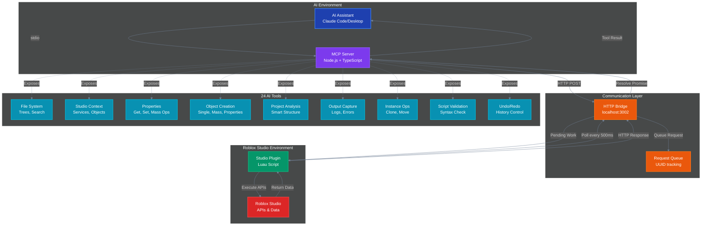
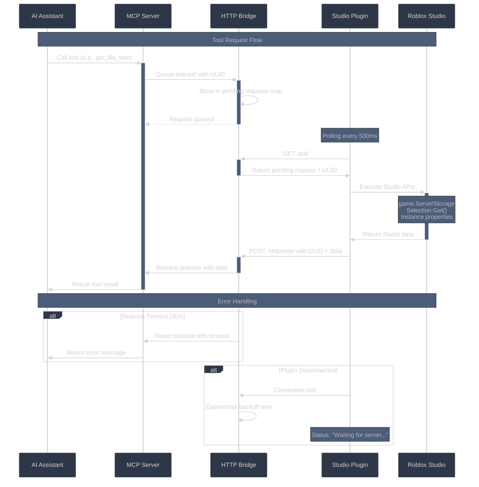

# Roblox Studio MCP Server

MCP server for AI-powered Roblox Studio integration. 24 specialized tools for exploring projects, analyzing scripts, and performing bulk operations.

https://devforum.roblox.com/t/v180-roblox-studio-mcp-speed-up-your-workflow-by-letting-ai-read-paths-and-properties/3707071

<a href="https://glama.ai/mcp/servers/@boshyxd/robloxstudio-mcp">
  
</a>

## Quick Start

**For Claude Code users:**
```bash
claude mcp add rbxstudio -- npx -y rbxstudio-mcp
```

**For other MCP clients (Claude Desktop, etc.):**
```json
{
  "mcpServers": {
    "rbxstudio-mcp": {
      "command": "npx",
      "args": ["-y", "rbxstudio-mcp"],
      "description": "Advanced Roblox Studio integration for AI assistants"
    }
  }
}
```

**Install NPM Package**
```bash
npm i rbxstudio-mcp
```

<details>
<summary>Note for native Windows users</summary>
If you encounter issues, you may need to run it through `cmd`. Update your configuration like this:

```json
{
  "mcpServers": {
    "rbxstudio-mcp": {
      "command": "cmd",
      "args": ["/c", "npx", "-y", "rbxstudio-mcp@latest"]
    }
  }
}
```
</details>

## Studio Plugin Setup (Required)

The MCP server requires a companion Roblox Studio plugin:

   - Download [MCPPlugin.rbxmx](https://github.com/boshyxd/robloxstudio-mcp/releases/latest/download/MCPPlugin.rbxmx)
   - Save to your `%LOCALAPPDATA%/Roblox/Plugins` folder

**After installation:**
- Enable "Allow HTTP Requests" in Game Settings > Security
- Click the "MCP Server" button in the Plugins toolbar
- Status should show "Connected" when working

## Architecture Overview

Dual-component system bridging Roblox Studio with AI assistants:



### Key Components:
- MCP Server (Node.js/TypeScript) - Exposes 24 tools via stdio
- HTTP Bridge - Request/response queue on localhost:3002
- Studio Plugin (Luau) - Polls server and executes API calls
- Smart Caching - Efficient data transfer

## 24 AI Tools

### File System Tools
- `get_file_tree` - Complete project hierarchy with scripts, models, folders
- `search_files` - Find files by name, type, or content patterns  

### Studio Context Tools  
- `get_place_info` - Place ID, name, game settings, workspace info
- `get_services` - All Roblox services and their child counts
- `search_objects` - Find instances by name, class, or properties

### Instance & Property Tools
- `get_instance_properties` - Complete property dump for any object
- `get_instance_children` - Child objects with metadata
- `search_by_property` - Find objects with specific property values
- `get_class_info` - Available properties/methods for Roblox classes

### Property Modification Tools 
- `set_property` - Set a property on any Roblox instance
- `mass_set_property` - Set the same property on multiple instances
- `mass_get_property` - Get the same property from multiple instances

### Object Creation Tools
- `create_object` - Create a new Roblox object instance
- `create_object_with_properties` - Create objects with initial properties
- `mass_create_objects` - Create multiple objects at once
- `mass_create_objects_with_properties` - Create multiple objects with properties
- `delete_object` - Delete a Roblox object instance

### Project Analysis Tools
- `get_project_structure` - Smart hierarchy with depth control (recommended: 5-10)

### Output Capture Tool (NEW in v1.9.0)
- `get_output` - Read Output window content (print, warn, error messages)

### Instance Manipulation Tools (NEW in v1.9.0)
- `clone_instance` - Clone/copy an instance to a new parent (deep copy)
- `move_instance` - Move an instance to a new parent location

### Script Validation Tool (NEW in v1.9.0)
- `validate_script` - Validate Lua/Luau syntax without running, includes deprecation warnings

### Undo/Redo Tools (NEW in v1.10.0)
- `undo` - Undo the last MCP operation in Studio's history
- `redo` - Redo a previously undone operation

> **Note:** All mutation tools (set_property, create_object, delete_object, etc.) are now automatically wrapped in ChangeHistoryService recordings, making every AI change undoable via Ctrl+Z in Studio or the `undo` tool.

> Note: Previous tools removed: `get_file_content`, `get_file_properties`, `get_selection`, `get_dependencies`, `validate_references`. Use Rojo/Argon workflows instead.

## AI-Optimized Features

### Mass Operations (v1.3.0)
- Bulk property editing
- Mass object creation
- Batch property reading
- Atomic undo/redo operations

```typescript
// Example: Set multiple parts to red
mass_set_property(["game.Workspace.Part1", "game.Workspace.Part2"], "BrickColor", "Really red")
```

### Smart Project Structure
- Service overview with child counts
- Path-based exploration: `get_project_structure("game.ServerStorage", maxDepth=5)`
- Script-only filtering for code analysis
- Intelligent grouping for large folders
- Recommended maxDepth=5-10

### Rich Metadata
- Script status tracking
- GUI intelligence
- Performance optimized

## Development & Testing

### Commands
```bash
npm run dev         # Development server with hot reload  
npm run build       # Production build
npm start           # Run built server
npm run lint        # ESLint code quality
npm run typecheck   # TypeScript validation
```

### Plugin Development
- Live reload
- Robust error handling
- Debug logging
- Visual status indicators

## Communication Protocol



**Features:**
- 30-second timeouts with exponential backoff
- Automatic retries
- Response limiting
- Request deduplication

## Example Usage

```javascript
// Get service overview
get_project_structure()

// Explore weapons folder
get_project_structure("game.ServerStorage.Weapons", maxDepth=2)

// Find all Sound objects
search_by_property("ClassName", "Sound")

// Get UI component details
get_instance_properties("game.StarterGui.MainMenu.SettingsFrame")

// === NEW in v1.9.0 ===

// Clone an object to a different location
clone_instance("game.Workspace.walkietalkie", "game.ReplicatedStorage")

// Move a tool to StarterPack
move_instance("game.Workspace.Sword", "game.StarterPack")

// Validate a script before running
validate_script("game.ServerScriptService.MainScript")

// Monitor game output after testing
get_output({ limit: 50, messageTypes: ["MessageError", "MessageWarning"] })

// === NEW in v1.10.0 ===

// Undo the last MCP operation
undo()

// Redo a previously undone operation
redo()
```

## Configuration

**Environment Variables:**
- `MCP_SERVER_PORT` - MCP server port (default: stdio)
- `HTTP_SERVER_PORT` - HTTP bridge port (default: 3002)
- `PLUGIN_POLL_INTERVAL` - Plugin poll frequency (default: 500ms)
- `REQUEST_TIMEOUT` - Request timeout (default: 30000ms)

**Studio Settings:**
- **Allow HTTP Requests** (Game Settings > Security)
- **HttpService.HttpEnabled = true**
- **Plugin activated** via toolbar button

## License

MIT License - Feel free to use in commercial and personal projects!
